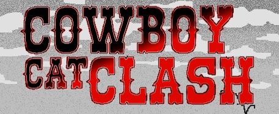
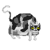
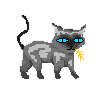

# Cowboy Cat Clash

## Installation & Running

To run the executable:

1. Download the [Release Version](https://github.com/senior-compsci-2023-2024/python-game-michelle_hu-hannah_hong/releases/tag/release)
2. Unzip folder
3. Run Cowboy_Cat_Clash.exe

To run Python:

1. Download [Pygame](https://www.pygame.org/wiki/GettingStarted)
2. Clone the repository
3. Go to src folder
4. Run main.py

## How to Play

### Objective

Defeat the other player in this local two-player fighting game!

### Rules

- Each player selects a fighter
- Fighters have unique playstyles and attacks
- The goal is to attack the other player's fighter until it reaches 0 HP

### Controls

Player 1
- Move left: A
- Move right: D
- Jump: W
- Light attack: E
- Heavy attack: Q

Player 2
- Move left: Left arrow
- Move right: Right arrow
- Jump: Up arrow
- Light attack: /
- Heavy attack: .

## The Fighters
Bowie - moderate speed and strength

Doodles - slow but very strong

Venturi's Cat - fast but less strong

